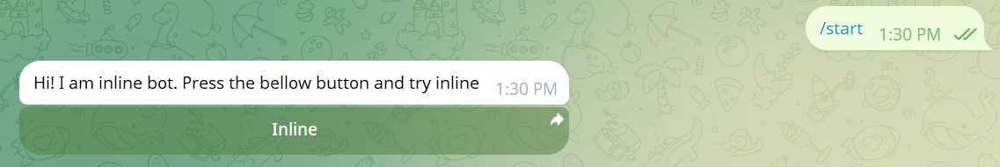

# Inline Mode Bot

In this example section, we will create a bot that supports Telegram's inline mode, allowing users to interact with the bot directly from any chat by typing `@botusername query`. This enables powerful features like instant content sharing, quick searches, and seamless bot interactions without leaving the current conversation.

---

We will use two different types of handlers:

* `onMessage` for handling commands in private chats
* `onInline` for handling inline queries from any chat

---

**Import necessary classes**

```java
package io.github.natanimn;

import io.github.natanimn.telebof.BotClient;
import io.github.natanimn.telebof.enums.ParseMode;
import io.github.natanimn.telebof.types.inline.InlineQueryResult;
import io.github.natanimn.telebof.types.inline.InlineQueryResultArticle;
import io.github.natanimn.telebof.types.input.InputTextMessageContent;
import io.github.natanimn.telebof.types.keyboard.InlineKeyboardButton;
import io.github.natanimn.telebof.types.keyboard.InlineKeyboardMarkup;
```

---

**Create `InlineBot` class and initialize `BotClient` with a `token`**

```java
public class InlineBot {
    public static void main(String[] args){
        final var TOKEN = System.getenv("TOKEN"); // Get bot token from environment variable
        final var bot = new BotClient(TOKEN); // Initialize bot client
        
        // Add handlers here
        
        bot.startPolling(); // Start the bot
    }
}
```

Our bot will be handling the following events:


* `/start` command in private chat
* Empty inline queries (when user just types `@botusername`)
* Inline queries with text input

---

**Create `/start` handler with inline button**

When the user types `/start` in a private chat, the bot responds with a message containing a button that triggers inline mode.

```java
bot.onMessage(filter -> filter.commands("start"), (context, message) -> {
    // Create an inline keyboard with a button that opens inline mode
    var keyboard = new InlineKeyboardMarkup(new InlineKeyboardButton[]{
            new InlineKeyboardButton("Inline").switchInlineQueryCurrentChat("")
    });
    
    // Send welcome message with the inline button
    context.sendMessage(message.chat.id, "Hi! I am an inline bot. Press the button below to try inline mode")
            .replyMarkup(keyboard) // Attach the inline keyboard
            .exec();
});
```


**Explanation:**


- `InlineKeyboardMarkup` creates an inline keyboard that appears below the message
- `InlineKeyboardButton("Inline")` creates a button with the specified text
- `.switchInlineQueryCurrentChat("")` makes the button open inline mode in the current chat when pressed
- The empty string `""` means no pre-filled query text

**Result:**


---

**Handle empty inline queries**

This handler is triggered when a user types just the bot's username (`@botusername`) without any additional text.

```java
bot.onInline(filter -> filter.emptyQuery(), (context, query) -> {
    // Create a result for empty queries
    var result = new InlineQueryResultArticle(
            "1", // Unique identifier for this result
            "Write something", // Title shown to the user
            new InputTextMessageContent("Write something") // Content that will be sent
    );
    
    // Send the result to the user
    context.answerInlineQuery(query.id, new InlineQueryResult[]{result}).exec();
});
```

**Explanation:**


- `filter.emptyQuery()` matches when the user doesn't provide any search text
- `InlineQueryResultArticle` creates a clickable result item
- `"1"` is a unique ID for this result (Can be any string)
- `"Write something"` is the title shown in the results list
- `InputTextMessageContent("Write something")` is the message that will be sent if the user selects this result
- `answerInlineQuery()` sends the results back to Telegram for display


---

**Handle inline queries with text input**

This handler processes inline queries where the user provides text after the bot's username (e.g., `@botusername hello world`).

```java
bot.onInline(_ -> true, (context, query) -> {
    // Create a result that echoes the user's input
    var result = new InlineQueryResultArticle(
            "2", // Unique identifier
            query.query, // Title shows the user's query
            new InputTextMessageContent("<b>You said:</b> " + query.query).parseMode(ParseMode.HTML)
    ).description("Click here"); // Optional description below the title
    
    // Send the result
    context.answerInlineQuery(query.id, new InlineQueryResult[]{result}).exec();
});
```

**Explanation:**


- `_ -> true` acts as a catch all for all inline queries (after the empty query handler)
- `query.query` contains the text the user typed after the bot's username
- `InputTextMessageContent()` creates formatted message content with HTML parsing
- `.description("Click here")` adds a descriptive text below the title
- The result shows the user's input and sends it back as a formatted message

**User Experience:**
When users type `@botusername some text`, they see a result that says "some text" and can send a message saying "You said: some text".

 
---

**Final Complete Code**

```java
public class InlineBot {
    public static void main(String[] args){
        final var TOKEN = System.getenv("TOKEN");
        final var bot = new BotClient(TOKEN);

        // Handle /start command with inline button
        bot.onMessage(filter -> filter.commands("start"), (context, message) -> {
            var keyboard = new InlineKeyboardMarkup(new InlineKeyboardButton[]{
                    new InlineKeyboardButton("Try Inline Mode").switchInlineQueryCurrentChat("")
            });
            context.sendMessage(message.chat.id, "Hi! I am an inline bot. Press the button below to try inline mode")
                    .replyMarkup(keyboard)
                    .exec();
        });

        // Handle empty inline queries (@botusername without text)
        bot.onInline(filter -> filter.emptyQuery(), (context, query) -> {
            var result = new InlineQueryResultArticle(
                    "1",
                    "Write something",
                    new InputTextMessageContent("Write something")
            );
            context.answerInlineQuery(query.id, new InlineQueryResult[]{result}).exec();
        });

        // Handle inline queries with text (@botusername some text)
        bot.onInline(_ -> true, (context, query) -> {
            var result = new InlineQueryResultArticle(
                    "2",
                    query.query,
                    new InputTextMessageContent("<b>You said:</b> " + query.query).parseMode(ParseMode.HTML)
            ).description("Click here");
            context.answerInlineQuery(query.id, new InlineQueryResult[]{result}).exec();
        });

        bot.startPolling();
    }
}
```

---

## How Inline Mode Works


1. **User types `/start`** → Bot sends message with inline button
2. **User presses button** → Telegram opens inline mode in current chat
3. **User types query** → Bot receives inline query and returns results
4. **User selects result** → Bot's message is sent to the chat

Alternatively, users can directly type `@botusername query` in any chat to use inline mode.

---

**The full source code can be found on** [examples/inline_bot](https://github.com/natanimn/telebof/blob/main/examples/long-polling/src/main/java/io/github/natanimn/InlineBot.java)
