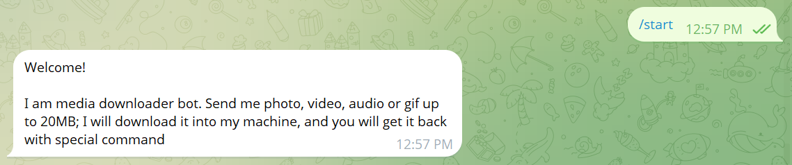
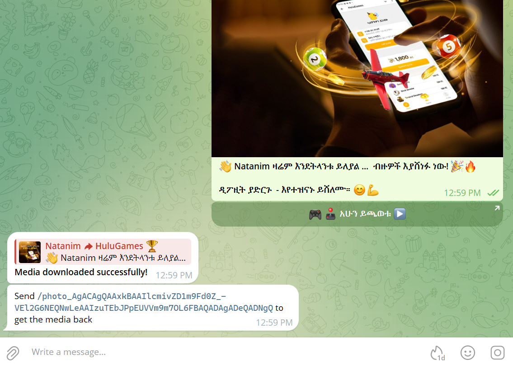

# Media Downloader Bot

In this example section, we will create a bot that downloads media files (photos, videos, GIFs, audio) sent by users, stores them locally, and allows users to retrieve them using special commands. This bot demonstrates file handling, custom filters, and media processing capabilities.

---

We will use different types of handlers and features:

* `onMessage` for handling commands and media messages
* `CustomFilter` for validating special retrieval commands
* File download and upload operations
* Multi threading for efficient media processing

---

**Import necessary classes**
```java
package io.github.natanimn;

import io.github.natanimn.telebof.BotClient;
import io.github.natanimn.telebof.BotContext;
import io.github.natanimn.telebof.enums.ParseMode;
import io.github.natanimn.telebof.filters.CustomFilter;
import io.github.natanimn.telebof.types.keyboard.ReplyParameters;
import io.github.natanimn.telebof.types.updates.Message;
import io.github.natanimn.telebof.types.updates.Update;
import java.io.FileOutputStream;
import java.io.File;
import java.util.Arrays;
```

---

## Custom Filter for Command Validation

**Create `IsValidCommand` class to validate media retrieval commands**

This filter ensures that commands follow the pattern `/type_fileId` where type is one of: photo, video, gif, or audio.

```java
class IsValidCommand implements CustomFilter{
    @Override
    public boolean check(Update update) {
        var text = update.message.text;
        if (!text.startsWith("/")) return false;

        var params = text.split("_");

        if (params.length == 1) return false;

        var prefix = params[0];
        var commands = new String[]{"/photo", "/video", "/gif", "/audio"};

        return Arrays.stream(commands).toList().contains(prefix);
    }
}
```

**Explanation:**


- Checks if the message starts with "/" and contains underscores
- Validates that the command prefix is one of the supported media types
- Ensures proper command format for media retrieval

---

**Let us create `MediaDownloader` class with a constructor and initialize `BotClient` with 10 threads for better performance**

```java
public class MediaDownloader {
    private BotClient bot;

    public MediaDownloader(String token){
        // Initialize bot with 10 threads for concurrent media processing
        this.bot = new BotClient.Builder(token).numThreads(10).build();
        
        var isValidCommand = new IsValidCommand();
        
        // Register handlers
        bot.onMessage(filter -> filter.commands("start"), this::start);
        bot.onMessage(filter -> filter.photo() || filter.animation() || filter.video() || filter.audio(), this::downloadMedia);
        bot.onMessage(filter -> filter.text() && filter.customFilter(isValidCommand), this::getMedia);
    }
}
```

Our bot will be handling the following events:


* `/start` command - Welcome message and instructions
* Media messages (photos, videos, GIFs, audio) - Download and storage
* Special retrieval commands (`/photo_fileId`, `/video_fileId`, etc.) - Media retrieval

---

**Create `/start` handler with welcome message**

```java
private void start(BotContext context, Message message){
    context.sendMessage(message.chat.id,
            """
            Welcome!
            
            I am media downloader bot. Send me photo, video, audio or gif up to 20MB; \
            I will download it into my machine, and you will get it back with special command"""
    ).exec();
}
```


---

**Handle media download when user sends photos, videos, GIFs, or audio**

This handler processes incoming media files, downloads them from Telegram servers, and stores them locally.

```java
private void downloadMedia(BotContext context, Message message) {
    
    // Send initial processing message as a reply to the media
    var msg = context.sendMessage(message.chat.id, "<code>Downloading media...</code>")
            .replyParameters(new ReplyParameters(message.message_id))
            .parseMode(ParseMode.HTML)
            .exec();

    String file_id, type, ext;
    
    // Determine media type and get the appropriate file ID
    if (message.photo != null) {
        file_id = message.photo.getLast().file_id; // Get highest quality photo
        type    = "photo";
        ext     = ".png";
    } else if (message.audio != null) {
        file_id = message.audio.file_id;
        type    = "audio";
        ext     = ".mp3";
    } else if (message.video != null) {
        file_id = message.video.file_id;
        type    = "video";
        ext     = ".mp4";
    } else {
        file_id = message.animation.file_id;
        type = "gif";
        ext = ".gif";
    }
    
    // Get file information and download the actual file content
    var file    = context.getFile(file_id).exec();
    byte[] data = context.downloadFile(file.file_path);

    // Save the downloaded file to local storage
    try(var stream  = new FileOutputStream(file_id + ext)){
        stream.write(data);
        
        // Update status message to indicate success
        context.editMessageText("<b>Media downloaded successfully!</b>", message.chat.id, msg.message_id)
                .parseMode(ParseMode.HTML)
                .exec();
                
        // Provide the user with the command to retrieve this media later
        context.sendMessage(message.chat.id, String.format("Send <code>/%s_%s</code> to get the media back", type, file_id))
                .parseMode(ParseMode.HTML)
                .exec();
    } catch (Exception e) {
        // Handle any errors during the download process
        context.editMessageText("An error occurred:\n\n" + e.getMessage(), message.chat.id, msg.message_id).exec();
    }
}
```

**The above code explanation goes as the following:**

```java
if (message.photo != null) {
    file_id = message.photo.getLast().file_id; // Get highest quality photo
    type    = "photo";
    ext     = ".png";
}
```

This section handles photos by selecting the last (and highest quality) version from the available photo sizes array.

```java
var file    = context.getFile(file_id).exec();
byte[] data = context.downloadFile(file.file_path);
```

These lines retrieve file information from Telegram and download the actual file content using the file path.

```java
try(var stream  = new FileOutputStream(file_id + ext)){
    stream.write(data);
```

This saves the downloaded media to a local file with the appropriate extension.

```java
context.sendMessage(message.chat.id, String.format("Send <code>/%s_%s</code> to get the media back", type, file_id))
```

This provides the user with a specific command they can use later to retrieve this exact media file.



---

**Handle media retrieval using special commands**

This handler processes commands in the format `/type_fileId` and sends back the corresponding media file.

```java
private void getMedia(BotContext context, Message message) {
    var param = message.text.split("_");
    var type = param[0].replace("/", ""); // Extract media type from command
    var file_id = String.join("_", Arrays.copyOfRange(param, 1, param.length)); // Reconstruct file ID
    var chat_id = message.chat.id;

    // Determine the correct file extension based on media type
    File file = switch (type){
        case "photo" -> new File(file_id + ".png");
        case "video" -> new File(file_id + ".mp4");
        case "gif" -> new File(file_id + ".gif");
        default -> new File(file_id + ".mp3"); // audio
    };

    if (file.exists()){
        // Send the appropriate media type based on the command
        switch (type){
            case "photo":
                context.sendPhoto(chat_id, file).exec();
                break;
            case "video":
                context.sendVideo(chat_id, file).exec();
                break;
            case "gif":
                context.sendAnimation(chat_id, file).exec();
                break;
            default: // audio
                context.sendAudio(chat_id, file).exec();
                break;
        }
    } else {
        context.sendMessage(chat_id, "Media not found").exec();
    }
}
```

**Explanation:**


- Parses commands like `/photo_BAACAgIAAxkBAAIlYmivZAV`
- Reconstructs the original file ID from the command parameters
- Checks if the file exists in local storage
- Sends the appropriate media type back to the user

---

**Finally, create `runBot` method and run the bot**

```java
public void runBot(){
    bot.startPolling();
}

public static void main(String[] args){
    final var TOKEN = System.getenv("TOKEN");
    final var downloader = new MediaDownloader(TOKEN);
    downloader.runBot();
}
```


---

**Our Media Downloader Bot can:**

*   Accept and process various media types (photos, videos, GIFs, audio)
*   Download files from Telegram servers and store them locally
*   Provide users with specific retrieval commands for each downloaded file
*   Retrieve and send back stored media files on demand
*   Handle multiple media processing operations concurrently using multiple threads

**The full source code can be found on** [examples/media_downloader](https://github.com/natanimn/telebof/blob/main/examples/long-polling/src/main/java/io/github/natanimn/MediaDownloader.java)
