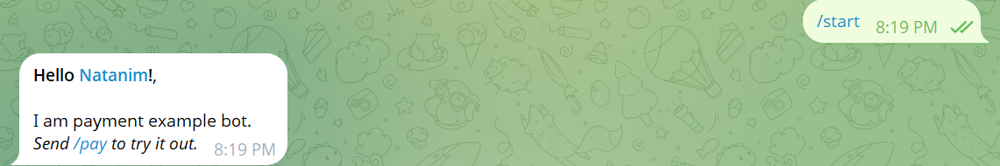
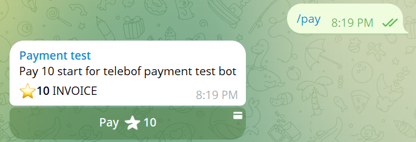
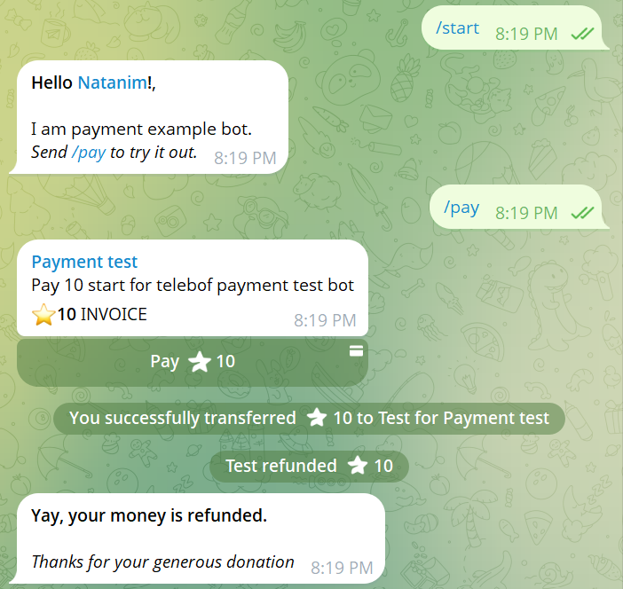

# Payment Example Bot

In this example section, we will create a bot that demonstrates Telegram's Stars payment system. The bot will send invoices, process payments, and handle refunds, providing a complete workflow for handling monetary transactions.

---

We will use two different types of handlers:

*   `onMessage` for handling commands (`/start`, `/pay`) and successful payment updates.
*   `onPreCheckout` for handling Precheckout queries (authorizing payments to proceed).

---

**Import necessary classes**

```java
package io.github.natanimn;

import io.github.natanimn.telebof.BotClient;
import io.github.natanimn.telebof.BotContext;
import io.github.natanimn.telebof.enums.ParseMode;
import io.github.natanimn.telebof.types.payments.LabeledPrice;
import io.github.natanimn.telebof.types.updates.Message;
import io.github.natanimn.telebof.types.updates.PreCheckoutQuery;
```

---

**Let us create the `PaymentExampleBot` class and initialize the `BotClient` with a `token` from an environment variable**

```java
public class PaymentExampleBot {
    static String TOKEN = System.getenv("TOKEN");
    public static void main(String[] args){
        BotClient bot = new BotClient(TOKEN);
        ...
    }
}
```

Our bot will be handling the following events:

*   `/start` command
*   `/pay` command
*   Precheckout queries (required step before payment is finalized)
*   Successful payment updates

---

**Create `/start` handler**

When the user types `/start`, the bot responds with a welcome message explaining its purpose.

```java
static void start(BotContext context, Message message){
    var user = message.from;
    context.sendMessage(message.chat.id, String.format(
            "<b>Hello %s!</b>,\n\nI am payment example bot.\n<i>Send /pay to try it out.</i>", user.mention()
            ))
            .parseMode(ParseMode.HTML)
            .exec();
}
```

**Add the handler inside the main method**
```java
bot.onMessage(filter -> filter.commands("start"), PaymentExampleBot::start);
```




---

**Create `/pay` handler and send an invoice**

When the user types `/pay`, the bot sends an invoice for 10 Telegram Stars.

```java
static void pay(BotContext context, Message message){
    // Create a price object for 10 Telegram Stars
    LabeledPrice price = new LabeledPrice("Pay 10 star", 10);

    /**
     * Send an invoice with the following parameters:
     * - chatId: The chat to send the invoice to
     * - title: The title of the invoice
     * - description: A description of what the user is paying for
     * - payload: A unique identifier for this transaction (used for validation)
     * - currency: "XTR" is the currency code for Telegram Stars
     * - prices: An array of LabeledPrice objects defining the cost
     */
    context.sendInvoice(
            message.chat.id,
            "Payment test",
            "Pay 10 start for telebof payment test bot",
            "pay-10", // In a real application, this should be a unique value per transaction
            "XTR",
            new LabeledPrice[]{price}
    ).exec();
}
```

**Add the handler inside the main method**
```java
bot.onMessage(filter -> filter.commands("pay"), PaymentExampleBot::pay);
```



---

**Handle PreCheckout Query**

After the user confirms payment in the invoice, Telegram sends a **precheckout query** to the bot. The bot **must** answer this query within a short time window to allow the payment to proceed or fail.

*This is a crucial step where you would typically:*


1.  Validate the payment details (e.g., check item prices, ensure the `payload` is valid).
2.  Check if the items are still in stock.
3.  Based on this check, confirm or deny the payment.

*For this example, we automatically confirm all queries.*

```java
static void processPrecheckOut(BotContext context, PreCheckoutQuery query){
    // Always confirm the checkout for this demo.
    // In a real application, add your validation logic here and answer false if it fails.
    context.answerPreCheckoutQuery(query.id, true).exec();
}
```
**Explanation:**


- The `PreCheckoutQuery` object contains all details about the impending payment.
- Calling `answerPreCheckoutQuery` with `true` tells Telegram the payment is authorized to be completed by the user.
- Calling it with `false` and an optional error message would decline the payment and inform the user.

**Add the handler inside the main method**
```java
bot.onPreCheckout(filter -> true, PaymentExampleBot::processPrecheckOut);
```

---

**Handle Successful Payment**

Once the Precheckout query is answered successfully and the user completes the payment, Telegram sends an `Update` containing a `Message` with a `successful_payment` field.

*In a real application, this is where you would:*

- Grant the user access to the purchased product or service.
- Generate and send a license key.
- Update your database to record the transaction.
- Fulfill the order.

*For this **demonstration**, we immediately refund the payment.*

```java
static void acceptPayment(BotContext context, Message message){
    // Extract the payment details from the message
    var payment = message.successful_payment;

    // REFUND THE PAYMENT (DEMONSTRATION ONLY)
    // This showcases the refundStars method.
    // In a real application, you would NOT do this; you would deliver the product instead.
    context.refundStarPayment(message.from.id, payment.telegram_payment_charge_id).exec();

    // Inform the user that their payment was received and immediately refunded
    context.sendMessage(message.chat.id,
            "<b>Yay, your money is refunded.</b>\n\n" +
            "<i>Thanks for your generous donation</i>"
    ).parseMode(ParseMode.HTML).exec();
}
```
> **Important Note:** The `refundStarPayment` call is for **demonstration purposes only**. A real bot would not charge users and then instantly refund them. This method is useful for handling legitimate refund requests or errors.

**Add the handler inside the main method**
```java
bot.onMessage(filter -> filter.successfulPayment(), PaymentExampleBot::acceptPayment);
```

---

**Final Setup and Execution**

All handlers are registered in the `main` method, and the bot is started using Long Polling.

```java
public static void main(String[] args){
    // Initialize the bot client with the token from an environment variable
    final var bot = new BotClient(TOKEN);

    // Register command handlers
    bot.onMessage(filter -> filter.commands("start"), PaymentExampleBot::start);
    bot.onMessage(filter -> filter.commands("pay"), PaymentExampleBot::pay);

    // Register payment handlers
    bot.onPreCheckout(filter -> true, PaymentExampleBot::processPrecheckOut);
    bot.onMessage(filter -> filter.successfulPayment(), PaymentExampleBot::acceptPayment);

    // Start the bot
    bot.startPolling();
}
```



---

**Summary**

This bot demonstrates a complete payment workflow using Telegram Stars:

1.  **Command:** User sends `/pay`.
2.  **Invoice:** Bot sends an invoice for 10 Stars.
3.  **PreCheckout:** Bot automatically authorizes the payment request.
4.  **Payment:** User completes the payment in the Telegram client.
5.  **Fulfillment:** Bot receives the successful payment update.
6.  **Refund (Demo):** Bot immediately refunds the payment to showcase the API method.

**Key Takeaways for a Real Application:**


*   Implement validation logic in `processPrecheckOut`.
*   Replace the refund logic in `acceptPayment` with actual product delivery.
*   Use a unique, identifiable `payload` for each invoice to link payments to orders in your database.
*   The `SuccessfulPayment` object contains valuable information like `invoice_payload`, `telegram_payment_charge_id`, `currency`, and `total_amount` which should be stored.

**The full source code can be found on** [examples/payment_bot](https://github.com/natanimn/telebof/blob/main/examples/src/main/java/io/github/natanimn/PaymentExampleBot.java)